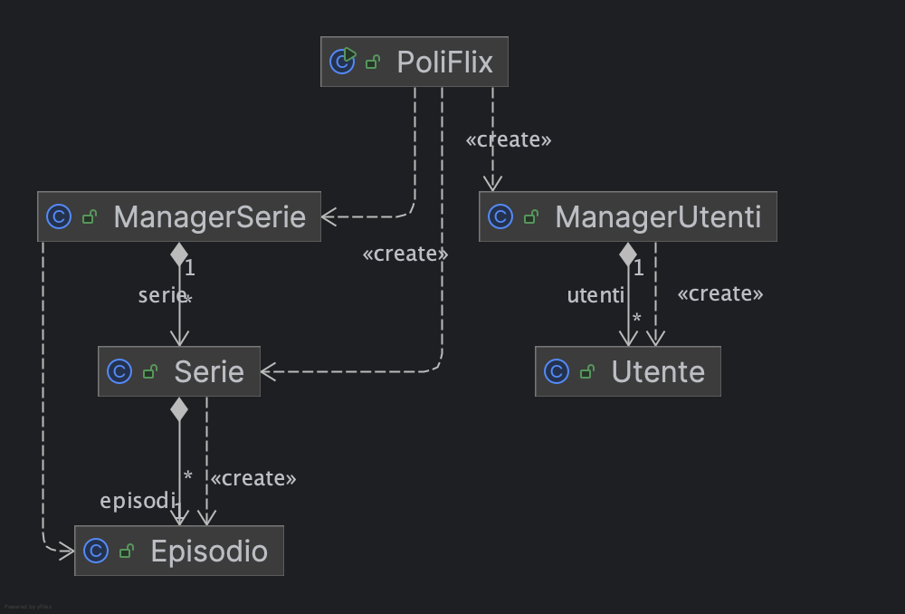

Questo repository raccoglie gli esempi mostrati a lezione. 
Di seguito, la descrizione, package per package, degli argomenti trattati:

<strong>1) Package: warm_up</strong>

- Obiettivo: ripassare le basi di Java e dell’I/O da console, strutture dati semplici e un primo mini‑esempio “PoliFlix”.
- File principali:
  - [main.warm_up.Step1](src/main/warm_up/Step1.java) 
    - Stampa su console
    - Tipi primitivi (int, double, boolean)
    - Stringhe e lettura input con Scanner
    - Ciclo while e condizione di uscita (comando "esci")
  - [main.warm_up.Step2](src/main/warm_up/Step2.java) 
    - Array e for “compatto” 
    - Liste 
  - [main.warm_up.Step3_PoliFlix](src/main/warm_up/Step3_PoliFlix.java) 
    - Mini applicazione testuale: registrazione e login utenti
    - Uso di liste parallele (username/password)
    - Menu a scelta con Scanner e gestione di uno “stato utente loggato”

<strong>2) Package: basi_oop</strong>

- Obiettivo: introdurre le basi della programmazione a oggetti (incapsulamento, oggetti e manager), lettura da file e una piccola app di esempio “PoliFlix”.

2.1) Sottopacchetto: basi_oop.poliflix
- File principali:
  - [poliflix.main.basi_oop.PoliFlix](src/main/basi_oop/poliflix/PoliFlix.java) (main)
    - Entry point dell’applicazione
    - Menu contestuale (non loggato/loggato)
    - Composizione con ManagerUtenti e ManagerSerie
  - [basi_oop.poliflix.serie.Utente](src/main/basi_oop/poliflix/utenti/Utente.java), [serie.poliflix.main.basi_oop.Serie](src/main/basi_oop/poliflix/serie/Serie.java), [serie.poliflix.main.basi_oop.Episodio](src/main/basi_oop/poliflix/serie/Episodio.java)  (modello dominio)
- Cosa mostra:
  - Incapsulamento e oggetti di dominio (Utente, Serie, Episodio)
  - Manager e composizione (PoliFlix + ManagerUtenti, ManagerSerie)
  - Lettura e parsing da CSV (Serie.leggiSerieDaCsv su resources/series.csv)

- Risorse d’esempio:
  - [resources/series.csv](resources/files/series.csv) (file CSV letto da Serie.leggiSerieDaCsv)

2.2) Sottopacchetto: basi_oop.file
- File principali:
  - [file.main.basi_oop.TestFile](src/main/basi_oop/file/TestFile.java) (main)
    - Scrittura su file con PrintWriter
    - Lettura con tre approcci: BufferedReader, Scanner, Files.readAllLines

- Cosa mostra:
  - Incapsulamento e oggetti di dominio (Utente, Serie, Episodio)
  - Manager e composizione (PoliFlix + ManagerUtenti, ManagerSerie)
  - Lettura e parsing da CSV (Serie.leggiSerieDaCsv su resources/series.csv)
  - Menu testuale con stato utente (non loggato/loggato)
  - Collezioni e iterazione su elenchi di oggetti

